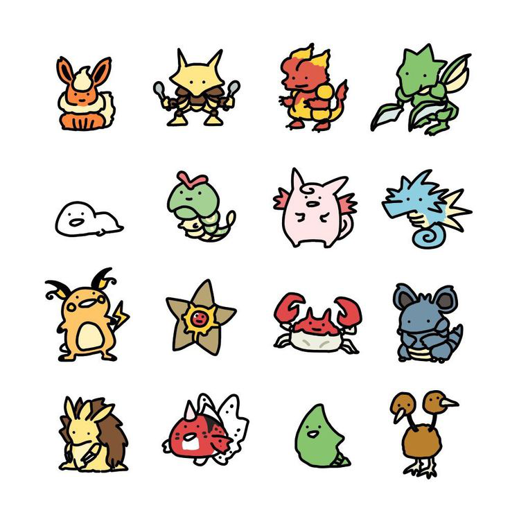
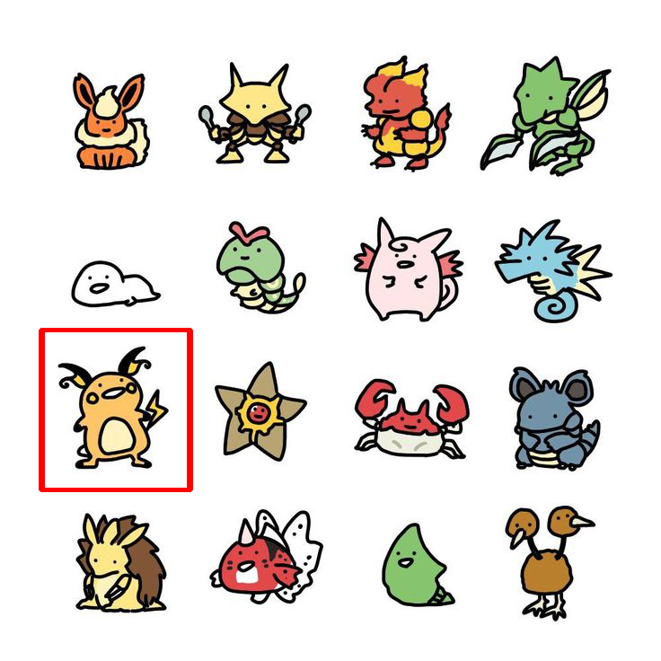

# template-matching.cv2.py

OpenCVを使用したテンプレートマッチ処理の動作確認モジュール。  

対象の画像は[Yukiさんのイラスト](https://www.pinterest.jp/pin/602004675207672336/)を使用しました。  

## どんな感じ???

### 以下のポケモンのイラスト画像から、、、
  
  

### かわいいライチュウを、、、

  

### 見つけます♪

  
